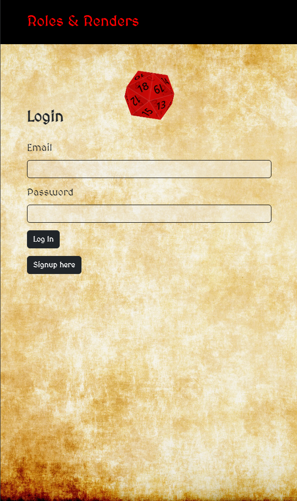
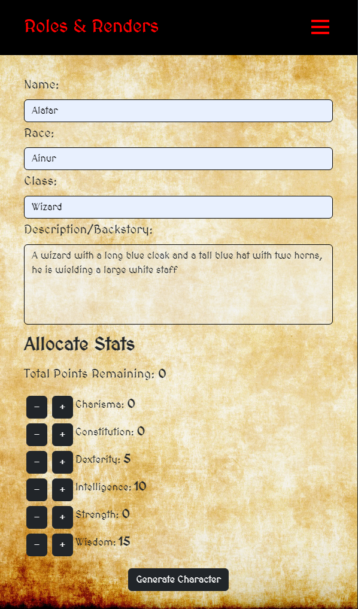
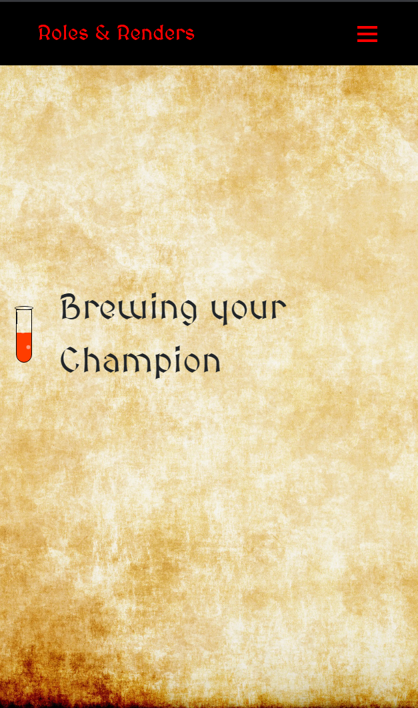
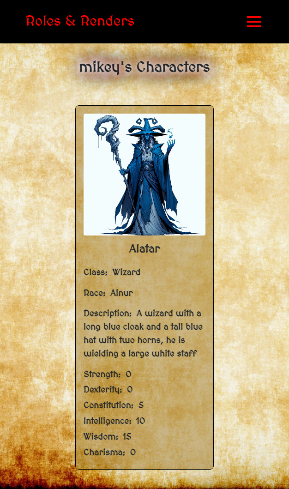

# Roles & Renders

## Description 

Roles & Renders is a Dungeons & Dragons themed character image generator! Maybe you arent very experienced with D&D and want to experiment with creating and visualizing new characters? Maybe your'e a highly experienced player and just want a way to quickly create new characters to try in your next campaign! Whether youre a novice or expert D&D player, you will love creating characters and watching them come to life!

## Visit the Website

https://dnd-generator-aorl.onrender.com


## Table of Contents
- [Description](#description)
- [Visit The Website](#visit-the-website)
- [About The Project](#about-the-project)
- [Technologies](#technologies)
- [Installation](#installation)
- [Usage](#usage)
- [Features](#features)
- [Credits](#credits)

## About The Project

This project was created with the intention of creating an efficent MERN stack application that uses mongodb and graphql for data mutations/queries and uses React state to fluidly transition between pages/components. Overall this application was created to create an immersive character generator that anyone can use even if you know nothing about D&D!

## Technologies 

- Dalle-3
- Javascript
- React
- GraphQL
- MongoDB

## Features

This application uses Open AI's Dall-e-3 image generation to create stunning high definition character images! When you first open the website you will be prompted to log in. If you havent created an account, you can click the signup button and you will be directed to the signup form where you can create a user. Once you've created your log in credentials, head to the log in page and use your newly created credentials to sign in to your account. Now the youre logged in you should be presented with a prompt page with inputs for: Name, Race, Class, and a Description/Backstory as well as stat distribution. Enter your character information along with the stats you want them to have, hit "Generate Character" and let the magic happen! Once youv'e created a character they will be saved under the "My Characters page" where you can return and view them later. You can create as many characters as you want so dont hesitate to get carried away!

## Installation
```YOU WILL NEED an .env file in the root of the server repo with an OPEN_AI_API_KEY and a JWT_SECRET```

You can get an API key from https://openai.com/

You will also need a JWT_SECRET. You can read  the Github Docs on JWT's to see how to generate one [Github Docs on JWT](https://docs.github.com/en/apps/creating-github-apps/authenticating-with-a-github-app/generating-a-json-web-token-jwt-for-a-github-app)


To install this application, fork the repo and then clone it down to your machine. in the node terminal run
```bash
npm install
```
To test development, in your node terminal run 
```bash
npm run dev
```
Now you should see the application running in your local client! Create a test account and get started creating characters!

For testing purposes you should also download mongodb compass amd connect to your localhost to test database functionality

## Screenshots









## Credits

This Project was made possible by the hands of 

[Mikey Whipple](https://github.com/EmpireAntz)

[Chris Davis](https://github.com/chriscodinghub)

[Dylan Coito](https://github.com/dylanmatthewcoito)

[Mack Dixon](https://github.com/techmack92)


